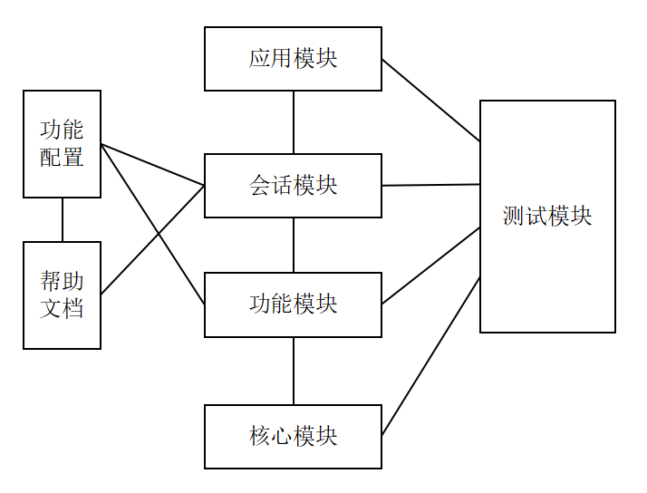
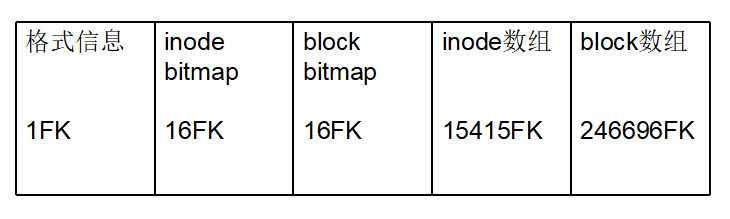
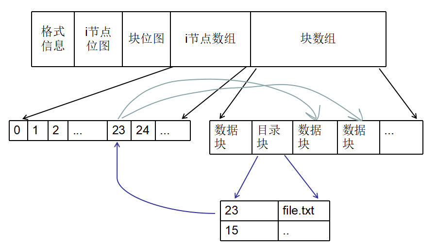
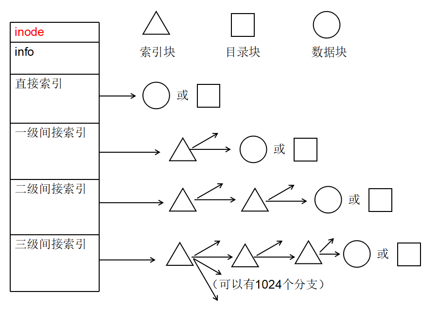
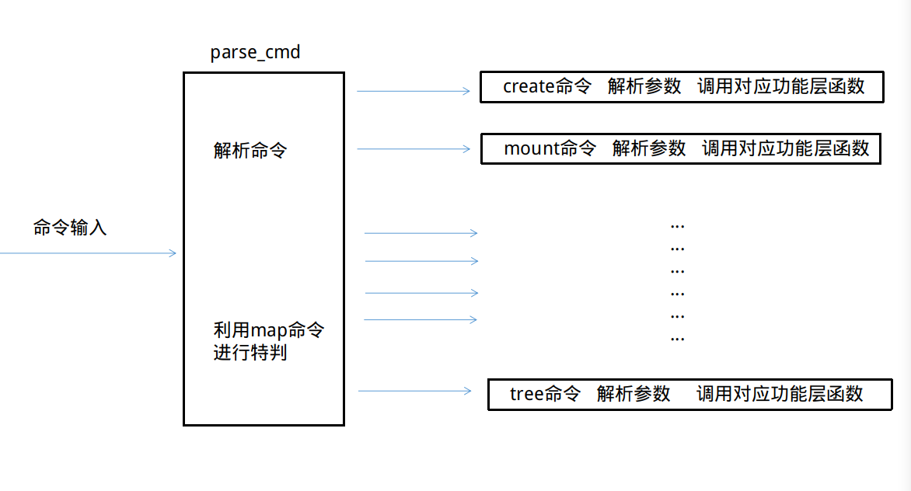

# MINI_FS 微型文件系统设计文档

> Author : 欧阳峻彦 曾令泽 侯佳成 辛高枫 张洛汐
>
> Version：1.0.1v


[TOC]


## 1.需求分析与初步设计

### 功能要求

| 命令名  |      命令参数       |                       命令功能                        |
| :-----: | :-----------------: | :---------------------------------------------------: |
| create  |     MINIFS路径      |        建立名为Name大小为1G的文件作为储存空间         |
|  mount  | MINIFS路径 MINIFS名 |       挂载MINIFS，并给它取个名字，方便后续操作        |
| unmount |   无参数/MINIFS名   | 无参数时打印已经挂载的MINIFS列表，有参数时卸载MINIFS  |
|   fmt   |         无          |                 格式化当前 SName 空间                 |
|   mk    |     -f/-d name      | 新建一个名为name的文件/文件夹，支持递归创建和多个创建 |
|   dr    |         无          |                打印当前路径下文件列表                 |
|   cp    | -f/-d/  PATH1 PATH2 |  复制文件(文件夹）由PATH1到PATH2，打括号则为外部文件  |
|   dl    |     -f(-d) name     |             删除空间中的文件/文件夹 name              |
|  tree   |         无          |             以树型方式显示文件目录和文件              |
|   mp    |        name         |   显示当前目录下指定文件name在空间所占用的全部块号    |
|   att   |        name         |                 显示空间文件name属性                  |
|   mv    |  -f/-d PATH1 PATH2  |           移动文件（文件夹）从PATH1到PATH2            |
|  find   |     find  name      |                 在当前目录下索引name                  |
|  help   |     cmd/无参数      |             打印cmd帮助信息/系统帮助信息              |
|  close  |         无          |                退出空间，返回操作系统                 |
|   in    |    PATH content     |            重写PATH文件，重写内容为content            |
|   tp    |        PATH         |                     打印文件内容                      |

### 其他需求

- - 能够充分利用存储空间，存储效率比较高
  - 删除文件的空间能够循环利用
  - 算法实现不能太复杂，效率尽可能高，执行时间不能过长


## 2.mini-FS模块及接口

**模块有以下几个**：

- 核心模块：用于将mini-FS下的空间级别的底层实现封装，提供文件级别的操作。
- 功能模块：实现所有命令的功能。
- 会话模块：用于处理终端和后端的通信。解析输入的字符串，转化为程序可识别的信息，以及将返回信息解释为用户友好的字符串。
- 应用模块：用于处理用户和终端的交互。与用户操作相关，涉及界面的显示，输入和打印的字符串显示，以及命令的调度。
- 测试模块：用于测试与debug。
- 其他部分：帮助文档等。

**模块与命名空间**：

所有命名空间统一小写。模块对外的接口写在相应可对外命名空间中（相当于public），否则写在不可对外命名空间中（相当于private）。对仅作用于当前文件的，写在匿名空间中。各命名空间的写法如下。

```C++
//可对外命名空间
namespace fs{}

//不可对外命名空间（只作告示作用，无法禁止外部访问）
namespace _fs{}

//匿名命名空间，仅作用于当前文件
namespace{}
```

- 核心模块：fs, _fs
- 功能模块：func, _func

- 会话模块：sess, _sess
- 应用模块：app, _app
- 测试模块：test, _test


**模块的大致关系图**：





### 核心模块设计文档

隐藏bitmap，lock，block等底层概念，向上层模块提供文件的读写等文件级别的操作

#### 数据结构设计

**组：**

组在空间中的组织如下图所示（仅示意），标准的一个组为1GB大小，对N个组（总共N组）来说，前面N-1组是满的，而最后一组可以不满。


但是由于最后一组不满，可能出现利用低的情况。假如每组的辅助信息有0.1GB，而第N组只有0.12GB，这样真正存数据部分只有辅助部分的1/5，显然此时对空间的利用是十分不合理的。


那么可以这样考虑，使每个组的的实际最大容量可以扩展到1.8到2GB，设置一个UPBOUND的大小值（比如1.8GB），但正常情况下仍然以1GB为准。当要求增加S的大小时，如果第N组当前分配大小SN+S<UPBOUND，则只对第N组扩容S；反之，分为两组，前一组为表准大小1GB，后面一组至少有(UPBOUND-1GB)的空间可以利用，而这大小对于额外信息部分已经很大了。

（实现时，采用1.75GB为UPBOUND）


**每个组的结构**

整个1G的空间被分为了5个部分，每个部分记录相应的信息，5个部分分别为：

- mini-FS的格式信息
- inode的位图信息
- block 的位图信息
- 储存inode的数组
- 储存block的数组


关于各部分大小计算，应考虑到4K对齐。根据设计，每个inode大小128B，每个block4KB，格式信息占用最初的4KB。假设一个标准组的块数为cnt，而组的实际可能扩充到可容下两倍左右cnt的block，这也要求inode位图，block位图，inode数组设计时实际上应该为2倍block数组大小作准备。则可以初步列以下方程：
$$
2(cnt+cnt+(128\times 8)cnt)+(4096\times 8)cnt+（4096\times 8）=（2^{30}\times 8）
$$
可计算得到cnt=246694.48087306146。根据对齐等情况可作略微调整，最后取cnt=246696。记4KB为FK（Four KB），则子后设计为：



可见这些数值有以下特性：

1. 总和为262144FK，恰好是1GB
2. block数组数为8的倍数，而由于4FK内有32个128KB，所以inode区可以容纳的inode数也是8的倍数。这样做的好处为inode和block的bitmap有效位可以组成整数个字节。这点也与空闲块的管理息息相关。
3. 必须满足inode bitmap容量=block bitmap容量>=inode数组容量>block数组容量*1.8，其中容量是指各区域可容纳相应数据的个数。经计算，上图设计下，inode数组为block数组容量的1.9995倍，而bitmap区，实际上只要15.054FK就能对应到inode数组中所有inode。因此对于这点，设计符合要求。
4. 246696/262144=0.941070556640625，也就是说，实际存储区占组空间的94%左右（此前我买的移动硬盘约为93%，这说明这个设计的空间利用率可以接受）
5. 如果要增加空间，必须增加32KB整数倍，以满足上面第二点所述特性


**mini-FS格式信息**

这个处于每个组开头的mini-SF的配置信息块是需要最先读入内存的，包括如下信息：


|                           格式信息                           |
| :----------------------------------------------------------: |
|                      版本信息（int32）                       |
|                        组数（int32）                         |
|                     空间总块数（int32）                      |
|               当前组索引（或称组id）（int32）                |
|                    当前组总块数（int32）                     |
|                     当前组大小（int64）                      |
| 当前组位图inode位图区相对文件开头位置的offset（int64）【实际上只有最后一个组可能不一样】 |
|             当前组位图block位图区offset（int64）             |
|               当前组位图inode区offset（int64）               |
|               当前组位图block区offset（int64）               |
| 组offset数组（int64 $\times$ 100)【实际上是不必要的，但是因为这一段占位较长，可以用作文件校验（目前只用版本号做校验）】 |
|                                                              |
|                    【限制到4096Byte以下】                    |


**inode位图和Block位图**

使用bitmap数据结构储存inode数组模块和block数组模块中空间的利用情况。如果某个某个block或inode被利用，则位图中对应的bit置1，否则置0。这意味着，两者实际占用空间的字节数等于当前组总块数的1/8。之后通过这两者定位和管理空闲块。比如删除操作，不对数据操作，二是把相应位图中的位置零。增加文件或者写入内容时，也可以快速获取第一个空闲位置。


**inode数组**

inode数组里面储存的是顺序排列的inode数据类型。一个文件唯一对应于一个inode。inode内部组织如下：

1. 头部有一块存储inode属性以及文件属性。如文件类型，文件权限（暂时只有读写权限），inode号，文件大小，文件创建时间，最后访问时间，最后修改时间，最后属性改变时间。

2. 索引部分，有多级索引：

   1. 直接索引：

      有12个，每一个指向一个数据块或者目录块。

      支持48KB数据

   2. 一级间接索引：

      有一个，指向一个一级索引块（一级索引块有1024个直接指向数据块或目录块的索引数据）

      支持4MB数据

   3. 二级间接索引：

      有一个，指向一个二级索引块（二级索引块可以指向1024个一级索引块）

      支持4GB数据（这限制了文件大小之多为4G，但实际实现时设定的更小）

3. 普通文件限制其只能使用到第二级间接索引，而文件夹限定只能使用到第一级间接索引。

|                            inode                             |
| :----------------------------------------------------------: |
|  文件类型 （char）：主要使用的有'd'（文件夹）和'f'（文件）   |
|      目录层级（int8）：但限制层级到5（只对文件夹有效）       |
| 树层级（int8）：以当前文件夹为根，目录树的层级（只对文件夹有效） |
|                      文件权限（int16）                       |
|                       结点号（int32）                        |
| 文件大小（或目录记录数）（int64）：对文件，为其数据的字节数；对文件夹，为记录数量，其中一条记录表示一个子文件 |
|                    占用block数量（int32）                    |
|                      创建时间（int64）                       |
|                    最后修改时间（int64）                     |
|                    直接索引（12 × int32）                    |
|                    一级间接索引（int32）                     |
|                    二级间接索引（int32）                     |
|                                                              |
|  【外存中默认inode大小为128B，则设计大小限制到128Byte以下】  |


**block数组**

block数组模块中是顺序储存的内容块，有三类block，一类是数据块（data_block），一类是目录块（dir_block），第三类是索引块（index_block）。 每个block占用4KB，而数据结构使用C++的联合类型实现

1. **数据块：**

   数据块内部用来存储文件内容。整个4KB全部用来存文件内容（二进制数据），没有其他多余的项。

   |       数据块        |
   | :-----------------: |
   | 数据（4096 × byte） |


2. **目录块：**

   目录块存储多条记录，每条有两项信息：inode索引（4B），文件名（13B=文件名8B+'.'1B+拓展名3B+'\0'）。根据设计，一个目录块记录有17B，考虑对齐有20B，则一个块共可以开辟204个目录块记录，另外留16B存当前块的记录数量。

   - 文件：

     存储两条记录：第一条代表文件本身，inode索引指向该文件的inode，文件名项该文件的文件名；第二条的inode指向上级目录（上级文件夹）的inode，文件名为两个英文句号，即“ .. ”。

     （上级目录项是为可能要实现的回收站机制做准备）

   - 文件夹：

     前两条和文件的一样。后面的每一条都记录了该目录下的子文件或子文件夹（记录他们的inode和文件名）。由于一个目录块能存的记录很有限，所以实际上文件夹可以占多个目录块，这是通过inode的索引区实现的。但是，由于限制了目录文件只是用到一级间接索引，所以实际上，只能使用到1036个目录块。

   |         inode索引         |     文件名     | padding    |
   | :-----------------------: | :------------: | ---------- |
   |           10024           |    “aaaaa”     |            |
   |            987            |      ".."      |            |
   |           15073           | "bbbbcccc.txt" |            |
   |            ...            |      ...       |            |
   |        [204 × 4B]         |  [204 × 13B]   | [204 × 3B] |
   | 当前块record数量（int16） |                |            |

3. **索引块：**

   这个块存了1024个占位4B的block索引。每一个指向一个块。如果是一级间接索引块，则指向数据块或目录快，否则指向下一级索引块。索引块的级别是通过代码逻辑实现的，与存储结构无关，即不管是几级索引块都是同一个数据结构。

   |             索引块              |
   | :-----------------------------: |
   | 1024个block索引（1024 × int32） |


#### 底层抽象结构和底层操作设计

1. **读取inode和block：**

   由于过于频繁访问外存效率低，所以对inode和block分别开一个哈希表（大小设置10007），将数据缓存到内存中，读取时，先在表中找。找到后，把哈希表中相应的数据复制到使用区。如果没找到，则到内存中读取数据，并分别写入哈希表和使用区。

2. **写入inode和block：**

   我们只是简单地把数据写入外存，并更改哈希表而已。这样实际上效率不高，甚至在开发时可能会由于失误重复写入，导致运行效率大大降低。但考虑到开发效率、维护成本以及自身能力，只好妥协。

3. **文件：**

   文件需要两个inode和至少一个block（目录块）。第一个inode记录文件信息，而它的第一个直接索引指向文件的目录块。文件的目录块只有两条记录：第一条记录文件数据inode的索引和文件名，第二条记录文件上级目录的inode索引和".."（这点设计是为了未来支持回收站机制，但由于时间关系未实现）。第二个inode为文件的数据inode（记为data_inode），其中的索引指向的block为文件实际数据块。这个设计其实很浪费空间，但考虑到inode的统一性和工期，我们选择妥协。

4. **文件夹：**

   文件夹需要一个inode和至少一个目录块。它的inode指向所有存有该文件子文件夹记录的目录块或一级间接索引块。inode直接索引区指向的第一个目录块的前两条数据和文件目录块是一样的。所以支持很多和文件同样的操作（比如同样可以支持回收站机制）。

5. **创建minifs：**

   创建指定大小的文件系统，并格式化。

6. **格式化minifs：**

   对指定的minifs文件格式化。格式化时，要计算block容量等基本信息以及各组的信息，分别写入各组的头部；对所有位图置零；先占用第一个inode和第一个block，创建根目录。

7. **增加文件：**

   申请两个inode和一个block（由于底层位图空闲块的管理，每次取的都是当前第一个空闲位置），在位图相应位置置1。并在inode和block中填入基本信息。初始文件没有内容，即空文件。因此文件信息中，文件大小为0，block占用数量为0（指数据的block）。然后，在创建文件的目录中增加记录。

8. **增加文件夹：**

   首先进行层级检测。申请一个inode和一个block，填入空文件夹所必要信息。然后在上级目录增加记录。最后进行层级控制操作（之后解释）。

9. **删除格式化**

   找到文件下的所有inode和block，对位图相应位置0。删除上级目录中的记录。

10. **删除文件夹：**

    这是个递归操作。先删除该文件夹的所有子文件和子文件夹。再删除该文件夹inode和相对应的所有block；然后进行层级控制。

11. **移动文件：**

    修改文件目录块中上级目录项的inode号。在原上级目录中删除该文件记录，在新上级目录中增加该文件的记录。数据不移动。

12. **移动文件夹：**

    首先根据该文件夹的“树层级”项和新上级目录的“目录层级”项，进行层级检测。如果层级超出限制则报错。如果可以移动，则和移动文件的操作一样。但最后还要进行层级控制操作。

13. **增加记录操作:**

    按从小到大顺序在文件夹目录块中找到第一个空闲的记录位置，写上记录。如果是文件夹的记录同样要做层级控制。

14. ##### 删除记录操作：

    我们设计上block中存的数据要连续，但实际上，记录并不是连续的。只要在连续的记录中间删除一条，就变得不连续了。因此单独删除记录不难，但麻烦的在于重新整理目录块。我们的做法是，首先在删除的那一块中整理。把其中所有的记录前移到该块的开头，形成连续的数组。目录块最后的record数要更改。如果把一个目录块清空了，则整理inode或索引块。总之，最多更改两个block。缺点在于，可能出现多个block记录数少的情况。这个未来可以加入再整理功能。

15. **层级控制：**

    - 目录层级项：

      只要保证每个文件夹的目录层级为上级目录的加1即可。根目录层级为0。移动文件夹，要递归地更改层级。

    - 树层级项：

      树层级项表示的是以该文件夹为根时，文件树的层级。

      如果将该节点记为A，在A处增加子树时，看这个增加操作是否会改变A的树层级项，如果不改变，则停止。否则，向上递归更改树层级项，直到不会更改或到文件系统根目录为止。

      在A删除子树后，此时，A的树层级项更新为当前直接子节点的树层级项+1（如果没了，则更新为0）。假如和原来一样，则停止，否则向上递归更改。

16. **文件读写：**

    以一个block为单位读写。文件内容保证连续。


#### 数值限制

1. 文件数据大小限制500MB
2. 目录层级限制5级，文件夹下子文件或子文件夹限制记录数最多只能占满第一级间接索引区
3. minifs大小下限256MB,上限2GB（可以扩充）


#### 部分原理图







#### 可改进之处

1. 代码较乱，可能有好几处重复读写
2. 位图管理不够好。现在是用最小堆管理空闲。但是，之后想到了更好更快的方法。即使用一个标记为管理。
3. 结构不够好，很多局部结构有待优化，但时间有限。


#### 核心模块接口：

```C++
//接口：
//注意以下int==int32, longlong==int64
//
namespace fs {

//管理MINIFS，设计上最多挂载3个，使用单例模式
class MiniFSGroup {
 public:
  ~MiniFSGroup();
  //获取单利；
  static MiniFSGroup& GetInstance();
  //挂载MINIFS
  //参数：
  //  outer_path: MINIFS 文件路径
  //  name: 给MINIFS命名（挂载时的临时名字）
  FSBase* mount(QString outer_path, QString name);
  //根据索引获取minifs的指针
  FSBase* get_fs(int fs_index);
  //根据名字获取MINIFS的指针
  FSBase* get_fs(QString name);
  //根据索引获取MINIFS名字
  QString get_name(int fs_index);
  //根据名字获取索引
  int get_fs_id(QString name);
  //获取索引和名字的键值对list
  QList<QPair<int, QString>> list_fs();
  //根据索引卸除文件系统
  void unmount(int fs_index);
  //根据名字卸除文件系统
  void unmount(QString name);
  //-----------------------------2018/9/11/22:07
  //获取当前已经挂载的minifs数量
  int get_current_pfs_num() { return cnt; }

 private:
  MiniFSGroup();
  MiniFSGroup(const MiniFSGroup&);
  int cnt = 0;
  FSBase* ptr_fs_array[3] = {nullptr, nullptr, nullptr};
  QString minifs_name_array[3] = {"", "", ""};
  QMap<QString, int> map_name_to_id;
};

//解析版本号（如 “13.5.6”）
QString parse_version(int32 version);
int32 parse_version(int v1, int v2, int v3);
int32 parse_version(QString version);

//创建文件系统
//参数：
//  outer_path: MINIFS 文件路径
//  fs_size: byte数量，暂时只能768MB-2GB
void create_minifs(QString outer_path, int64 fs_size);

//格式化文件系统
void format_minifs(QString outer_path);
void format_minifs(QFile* outer_file);

//改变指定文件系统的当前路径
//参数：
//  pfs: MINIFS（FSBase类型，这个通过MiniFSGroup的函数可以获取）
//  path: MINIFS内部路径
void change_current_dir(FSBase* pfs, QString path);
//获取指定MINIFS当前路径
QString get_current_dir(FSBase* pfs);

//指定pfs，将dir_path目录下的文件名列表返回
QStringList list_dir(FSBase* pfs, QString dir_path);
    
//------------------------------------------2018/9/11/21:30
//指定pfs，将dir_path目录下的文件名以及文件信息列表返回
//<QPair<FSFileAttr, QString>>两值分别为属性和文件名
QList<QPair<FSFileAttr, QString>> list_dir_with_attr(FSBase* pfs,
                                                     QString dir_path);

//指定pfs,在pfs的当前目录下创建dir_name文件夹
void create_dir(FSBase* pfs, QString dir_name);
//指定pfs,在pfs的当前目录下创建file_name文件
void create_file(FSBase* pfs, QString file_name);

//改变文件读写权限,详细见FileAuth类型
void change_auth_mod(FSBase* pfs, QString path, FileAuth auth);
void change_auth_mod(FSFile* file, FileAuth auth);

// 9/12
//获取文件夹层级（从root到此）,如果输入路径表示的不是文件夹，返回-1
//根目录层级为0,根目录下一级目录层级为1，以此类推
//普通文件不计层级
int8 get_dir_layer(FSBase* pfs, QString path);

// 9/12
//获取以此文件夹为根时目录树的层级,,如果输入路径表示的不是文件夹，返回-1
//普通文件不计层级
int8 get_tree_layer(FSBase* pfs, QString path);

// 9/12
//移动文件夹或文件
void move(FSBase* pfs, QString former_path, QString new_path);
void move(FSFile* file, QString new_path);

//获取文件属性
FSFileAttr get_file_attr(FSBase* pfs, QString path);
FSFileAttr get_file_attr(FSFile* file);

//打开文件
FSFile* open(FSBase* pfs, QString path, FSFile::OpenMode mode);
FSFile* open(FSBase* pfs, QString path);
//关闭文件
void close(FSFile* file);

//读操作（对文件夹无效）
//参数：
//  file: FSFile文件指针
//  data: 数据指针
//  offset_in_file: 在文件中的偏置
//  max_size: 数据字节数;
int64 read(FSFile* file, char* data, int64 offset_in_file, int64 max_size);

//写操作（内部实现为以block大小为单位写入）（对文件夹无效）
//参数：
//  file: FSFile文件指针
//  data: 数据指针
//  offset_in_file: 在文件中的偏置
//  max_size: 数据字节数;
void write(FSFile* file, char* data, int64 offset_in_file, int64 max_size);

//添加操作，在文件尾部添加内容（对文件夹无效）
//参数：
//  file: FSFile文件指针
//  data: 数据指针
//  max_size: 数据字节数;
void add_content(FSFile* file, char* data, int64 max_size);

//清空文件（对文件夹无效）
void clear(FSFile* file);

//删除文件
void remove(FSBase* pfs, QString path);
void remove(FSFile* file);
    
//
index_t get_rest_inode_num(FSBase* pfs);
index_t get_rest_block_num(FSBase* pfs);
QList<index_t> get_block_id_list(FSBase* pfs, QString path);  


class FSFile {
 public:
  // R读,W写,RW读和写,A文件尾部添加
  typedef enum { R, W, RW, A } OpenMode;
};

//-----------------------2018/9/11/22:10
//文件权限
//重载了赋值运算
class FileAuth {
 public:
  typedef enum { AUTH_NONE = 0, AUTH_R = (1 << 0), AUTH_W = (1 << 1) } AuthMod;
  //可以使用位运算，例如：
  //可读可写的文件:FileAuth(FileAuth::AUTH_R|FileAuth::AUTH_W)
  FileAuth(int16 auth_mod) { set_auth(auth_mod); }
  //可读可写的文件:FileAuth("rw")
  FileAuth(QString auth_mod) { set_auth(auth_mod); }
  //默认可读可写
  FileAuth() { set_default(); }
  bool can_read() { return AUTH_R & this->auth_mod; }
  bool can_write() { return AUTH_W & this->auth_mod; }
  void set_default() { set_auth("rw"); }
  void set_auth(int16 auth_mod) { this->auth_mod = auth_mod; }
  void set_auth(QString auth_mod);

 private:
  int16 auth_mod;
};

//-----------------------2018/9/11/22:10
//重载了赋值运算
typedef struct FSFileAttr {
  char file_type;     //文件类型
  FileAuth auth;      //文件权限数
  index_t block_num;  //占用块数
  offset_t size;      //文件大小
  int64 create_time;  //创建时间
  int64 change_time;  //最近访问时间
} FSFileAttr;
    
}  // namespace fs
    
    
    
```


### 功能模块设计文档

功能层调用核心底层的接口，实现需求功能，并向对话层提供实现功能的接口


#### 功能实现描述


**显示空间中的目录文件（dr操作）**

*需要参数：PATH或无*

*操作结果：打印出当前或PATH路径下的所有文件*

遍历当前目录文件的目录块，取出其中文件名信息，存为数组，最后打印。


**切换当前目录（cd操作）**

*需要参数：PATH*

*操作结果:不成功抛出错误*

调用核心模块接口，切换到指定目录。


**拷贝文件（cp操作）**

*需要参数：操作选项 -x 源文件的路径PATH1  拷贝文件的路径PATH2*

*操作结果：成功不打印，不成功抛出错误*

外部路径用括号

（1）拷贝文件到空间：

申请新inode，根据PATH2在新位置上级目录块中添加新文件的文件名与inode索引。再递归地拷贝所有源文件信息、数据，通过miniFS的存储方式存储到空间中（内存只作中转站，每次被拷贝的单位为块）。修改bitmap。

（2）拷贝空间文件到外部：

读取对应文件，再把信息写入外部文件。


**删除文件（dl操作）**

*需要参数：源文件的路径 PATH*

*操作结果：成功不打印，不成功抛出错误*

根据PATH到对应文件，并获取相关的所有inode和block索引，根据索引在相应bitmap中的对应位置置0。


**优化储存空间（op操作）**

*需要参数：无*

*操作结果：返回一个判定是否优化成功的值，并将其打印*

暂时未能实现


**移动文件（mv操作）**

*需要参数：源文件的路径PATH1 文件移动目的地的路径PATH2*

*操作结果：成功不打印，不成功抛出错误*

修改文件目录块A对应的上级目录块P1，去除P1中A的信息，并根据PATH找到新上级目录块P2，在其中加上A的信息（即文件名和inode索引）


**新建文件或文件夹（mk操作）**

*需要参数：需要新建文件的路径PATH*   新建文件还是文件夹 （-d/-f)

*操作结果：在PATH下创建一个新的文件*

根据PATH，先申请一个inode，在上级目录的目录块中增加一条记录（inode与文件名），如果是新建文件，暂时不给该文件的inode分配任何数据块，如果是目录文件，则要在目录块中增加 . (当前目录)与 ..（上级目录）并做好配置。


**查询文件（find操作）**

*需要参数：索引文件名*

*操作结果：如果查询成功打印索引文件的绝对路径,不成功打印提示*

在当前目录下（以后可能会指定目录），进行递归遍历，找到文件名称与所给字符串部分匹配的文件（找到该文件名的记录所在的目录块），记录再list中，最后输出list。


**重命名文件（rename操作）**

*需要参数：原文件名name1 更改文件名name2*

*操作结果：成功不打印，不成功抛出错误*

rename操作用到了底层的mv操作，再当前文件夹下移动，更新他的路径名称，即完成重命名。（最后因为时间关系没实现）


**重写文件（in操作）**

*需要参数：文件路径PATH 写入内容content*

*操作结果：写入成功无提示，写入失败抛出错误*

打开文件，写入内容content，关闭文件。


**查找文件属性（att操作）**

*需要参数：文件路径PATH*

*操作结果：成功打印文件属性，失败抛出错误*

调用核心模块接口返回FSFileAttr对象，打印对象内容


**树型展示目录（tree操作）**

*需要参数：无*

*操作结果：成功打印树型目录，失败抛出错误*

利用dfs搜索当前目录下的所有文件，搜索过程中，判断文件类型，若为文件，则打印，若为文件夹，则打印并以该文件夹进行递归。


#### 可改进之处：

1. opt功能未能完全实现


#### 功能模块接口：

```c++
namespace func {
//*--------------------功能模块----------------------*
    void create(QString name);
    //创建文件系统，并命名为name

    void mount(QString name);
    //挂载name文件系统

    void fm();
    //格式化当前文件系统

    void close();
    //关闭当前文件系统

    void mk_create_file(QString name);
    void mk_create_dir(QString name);
    //mk 新建操作 ,创建成功，打印提示消息，创建失败，打印对应error

    void dr_prt_file();
    //dr 打印操作，打印出当前目录下的所有文件

    void cp_copy_file(QString in_PATH,QString out_PATH);
    void cp_copy_dir(QString in_PATH,QString out_PATH);
    //cp 复制操作，复制成功，打印提示消息，复制失败，打印对应error`

    void dl_delete_file(QString PATH);
    void dl_delete_dir(QString PATH);
    //dl 删除操作，删除成功，打印提示消息，删除失败，打印对应error

    void tp_display(QString PATH);
    //tp 展示操作 打印文件内容

    void tr_display();
    //tree 树型打印出当前目录下所有子目录和文件

    void at_display(QString NAME);
    //att 打印文件属性

    void mp_dispay();
    //map 展示文件系统下所利用的block

    void mv_move_file(QString in_PATH,QString out_PATH);
    void mv_move_dir(QString in_PATH,QString out_PATH);
    //mv 移动操作，移动成功，打印提示消息，移动失败，打印对应error

    void cd_change_dir(QString PATH);
    //cd 切换操作，切换目录成功，打印当前目录路径，切换失败，打印对应error

    void ff(QString NAME);
    //find 查询操作，在current路径下查找名为name的文件或文件夹，成功，打印文件路径，失败，打印对应error

    void help();
    void help(QString cmd);
    //help 帮助  传入cmd则打印对应命令的帮助文档 无参数则打印minifs系统的所有命令及操作须知


    void in_rewrite(QString PATH,QString message);
    //in 写入操作  重写文件内容

    void name_rename(QString former_name,QString current_name);
    //name 重命名操作


//*-------------------功能辅助函数----------------------*

    void tree_dfs(int deep,QList<int>is_last);
    //tree 功能辅助函数 递归函数

    void ff_dfs(int deep,QString NAME);
    //find 功能辅助函数 递归函数

    void prt_file(QString name);
    //文件 GREEN 打印

    void prt_dir(QString name);
    //文件夹 BOLDBLUE 打印

    QString where_path();
    //返回当前文件夹路径 便于显示
}
```
### 会话模块

会话模块负责从命令行读取命令，并对命令进行解析，判断命令的合法性，并根据命令调用功能层的函数


#### 会话层图解：




#### 可改进之处：

1.tab补全存在bug未能投入使用

2.未能记录输入历史，并且用↑↓键调用历史


#### 会话模块接口：

```c++
namespace sess{
//*--------------------会话模块----------------------*
    void parse_cmd(QString cmd,std::map<std::string,int>map_cmd);
    //解析命令 进行特判
    
    void user_interface();
    //用户界面
    
    void parse_create(QString command);
    //解析create命令，并判断输入格式是否规范
    
    void parse_mount(QString command);
    //解析mount命令，并判断输入格式是否规范
    
    void parse_format(QString command);
    //判断输入格式是否规范
    
    void parse_close(QString command);
    //判断输入格式是否规范
    
    void parse_make(QString command);
    //解析mk命令，并判断输入格式是否规范
    
    void parse_dr(QString command);
    //解析dr命令，并判断输入格式是否规范
    
    void parse_cp(QString command);
    //解析cp命令，并判断输入格式是否规范
    
    void parse_delete(QString command);
    //解析dl命令，并判断输入格式是否规范
    
    void parse_tp(QString command);
    //解析tp命令，并判断输入格式是否规范
    
    void parse_tree(QString command);
    //解析tree命令，并判断输入格式是否规范
    
    void parse_att(QString command);
    //解析att命令，并判断输入格式是否规范
    
    void parse_move(QString command);
    //解析mv命令，并判断输入格式是否规范
    
    void parse_help(QString command);
    //解析help命令，并判断输入格式是否规范
    
    void parse_in(QString command);
    //解析in命令，并判断输入格式是否规范
    
    void parse_name(QString command);
    //解析name命令，并判断输入格式是否规范
//*-------------------辅助函数----------------------*
    void prt_warning(QString command);
    //打印警告
    
}
```

### 应用模块

因为时间原因现在app模块和会话模块合并。

### 测试模块

详情请见测试文档


## 3. 其他


1. #### 常驻内存的信息：

   1. 基本配置信息
   2. inode bitmap，用位压缩的方式存储inode的利用情况
   3. block bitmap，用位压缩的方式存储block的利用情况
   4. 该文件系统根目录文件（默认为第一个inode和第一个block）
   5. 用于寻找bitmap中空闲位的数据结构（初步确定使用最小堆）
   6. inode哈希表，block哈希表。用于缓存数据。对频繁访问同一块的情况提升较大。

2. #### 如何根据需要读取要处理的部分:

   1. 根据inode的指示逐个地读取block信息。先根据一级索引，后是二级。
   2. 不管是inode还是block，读取前都要计算哈希值，如果哈希表中存在副本，就不用到外存中读取。

3. #### 内存如何和外存同步：

   1. 首先是bitmap，要对其变更时，内存中的bitmap首先变更，因为要快速告诉别的进程某块inode或block正在被占用。写入时，bitmap是最后写入的，防止在内容被写入数据块中途中断操作导致数据不完整，因为这样写意味着只有写操作进行完的块才可以在bitmap中被置1。
   2. 哈希表的作用主要体现在读取部分。写部分，采用写直达方式，内存和外存同时变更（暂时这样设计，但是这样对效率没有提升）。

4. #### others：

   1. 限制目录级别和文件大小（5级，500MB）
   2. 限制同一个文件夹下文件或文件夹的数量：只允许用一级间接索引（1024+12个子文件）


